# 🚀 AIC OCR Studio — Trích Xuất Chữ Tiếng Việt & Bounding Box Siêu Tốc (GPU CUDA)

<p align="center">
  
</p>

<p align="center">
  <a href="#tính-năng-nổi-bật"></a>
  <a href="#hiệu-năng--benchmark"></a>
  <a href="https://pytorch.org/"></a>
  <a href="https://onnxruntime.ai/"></a>
  <a href="https://fastapi.tiangolo.com/"></a>
</p>

---

## 📖 Giới thiệu Dự án

**AIC OCR Studio** là hệ thống nhận diện quang học ký tự (Optical Character Recognition - OCR) chuyên biệt cho **Tiếng Việt**, được tối ưu hóa toàn diện trên phần cứng **GPU NVIDIA (CUDA)**. 

Dự án tích hợp mô hình phát hiện vùng chữ đa giác **DBNet (ONNX Runtime CUDA)** kết hợp cùng mô hình nhận dạng chuỗi ký tự tiếng Việt **VietOCR Transformer**, mang lại tốc độ xử lý siêu tốc **~190 - 340 ms/ảnh** (tăng tốc gấp **~25 lần** so với giải pháp chạy CPU truyền thống) trong khi vẫn bảo toàn tuyệt đối độ chính xác của các dấu thanh âm học phức tạp.

---

## ✨ Tính năng Nổi bật

- ⚡ **Tăng tốc phần cứng GPU toàn diện (End-to-End GPU)**:
  - **Phát hiện vùng chữ (Detection)**: Sử dụng DBNet chạy trực tiếp trên `CUDAExecutionProvider` của ONNX Runtime — thời gian suy luận chỉ **~15 - 18 ms**.
  - **Nhận diện chữ (Recognition)**: Ứng dụng kỹ thuật **True Single-Pass Padded Batching** trên VietOCR GPU, đưa toàn bộ vùng chữ vào một lượt forward duy nhất — giảm thời gian nhận diện từ 600ms xuống chỉ **~160 ms**.
- 🇻🇳 **Bảo toàn 100% Dấu thanh Tiếng Việt (Adaptive Polygon Expansion)**:
  - Tự động mở rộng biên đa giác trực tiếp trên ảnh gốc (+22% chiều dọc, +4% chiều ngang) trước khi cắt phối cảnh (`perspective_crop`), loại bỏ hoàn toàn lỗi xén cụt dấu mũ (`^`), dấu sắc, hỏi, ngã, nặng hoặc lỗi biến dạng dấu do lặp mép biên.
- 🛡️ **Hậu xử lý NLP & Chuẩn hóa Unicode NFC**:
  - Chuẩn hóa dạng dựng sẵn **NFC** (`unicodedata.normalize`).
  - Sửa lỗi dính liền từ hoa phổ biến: `CÀPHÊ` $\to$ `CÀ PHÊ`, `VIỆTNAM` $\to$ `VIỆT NAM`.
  - Bộ từ điển bảo toàn chữ hoa/thường sửa các cặp âm dễ nhầm: `cà phé` $\to$ `cà phê`, `phố cô / phổ cổ` $\to$ `phố cổ`.
- 🎨 **Giao diện Web Demo Hiện đại & Trực quan (AIC Studio)**:
  - Hỗ trợ tải ảnh bằng nhiều hình thức: **Kéo & thả**, **Chọn từ máy**, hoặc **Dán trực tiếp từ Clipboard (`Ctrl + V`)**.
  - Bounding Box dạ quang đa giác với hiệu ứng **Hover Highlight hai chiều** (rê chuột vào danh sách bên phải sẽ làm sáng box tương ứng trên ảnh).
  - Thanh cấu hình tham số thời gian thực: *Detection Threshold, Min Confidence, CLAHE Contrast Boost, Upscale chữ nhỏ, Beam Search*.
  - Tích hợp công cụ xem ảnh tương tác: Phóng to, thu nhỏ, kéo lia (Pan & Zoom), xuất file `.txt` và `.json`.
- 🧪 **Kho Test Case Thử Thách Cực Độ Tích Hợp Sẵn**:
  - Hóa đơn VAT chi tiết dày đặc (46 vùng chữ).
  - Biển hiệu phối cảnh 3D góc nghiêng.
  - Chữ Neon phát sáng chói lóa trên nền gradient tối.
  - Menu quán cà phê 2 cột kèm bảng giá.

---

## 📊 Hiệu năng & Benchmark Thực tế (NVIDIA RTX 4060)

| Công đoạn | Trước khi tối ưu (CPU + PaddleX) | Sau khi nâng cấp (GPU ONNX + Batching) | Mức độ cải thiện |
| :--- | :---: | :---: | :---: |
| **Phát hiện vùng chữ (Detection)** | ~6.000 ms | **~15 - 18 ms** | **Nhanh hơn ~350 lần** 🚀 |
| **Nhận diện chữ (Recognition)** | ~1.500 - 4.500 ms | **~160 - 200 ms** | **Nhanh hơn ~10 - 20 lần** ⚡ |
| **Tổng thời gian xử lý toàn bộ ảnh** | **~7.500 - 11.000 ms** | **~190 - 340 ms** | **Tăng tốc ~25 - 30 lần** |
| **Xử lý dấu thanh phức tạp** | Hay bị lỗi (`CÀ PHÉ`, `???`) | **`CÀ PHÊ PHỐ CỔ` (100% chuẩn)** | Khắc phục triệt để |

---

## 🏗️ Kiến trúc Pipeline

```mermaid
flowchart LR
    A[Ảnh đầu vào] --> B[Tiền xử lý & Chuẩn hóa Kích thước]
    B --> C[ONNX DBNet CUDA<br/>~16 ms]
    C --> D[Mở rộng Đa giác Tự nhiên<br/>+22% Height, +4% Width]
    D --> E[Cắt Phối cảnh & Bù lề Thực<br/>Perspective Crop]
    E --> F[Gom Batch Đệm Đồng nhất<br/>True Single-Pass Tensor]
    F --> G[VietOCR Transformer GPU<br/>~160 ms]
    G --> H[Hậu xử lý NLP & Unicode NFC<br/>Sửa lỗi ngữ cảnh]
    H --> I[Kết quả Bounding Box & Text]
```



---

## 📸 Một số Hình ảnh Kiểm thử Thực tế

### 1. Hóa đơn VAT chi tiết (46 vùng chữ phân định rõ nét)
<p align="center">
  
</p>

### 2. Bảng điều khiển tham số OCR nâng cao (Settings Drawer)
<p align="center">
  
</p>

---

## 🚀 Hướng dẫn Cài đặt & Sử dụng

### 1. Yêu cầu Hệ thống
- **Hệ điều hành**: Windows 10/11 hoặc Linux (Ubuntu 20.04+).
- **Python**: Phiên bản `3.10` hoặc `3.11` / `3.12`.
- **GPU**: NVIDIA GPU (RTX series hoặc GTX) có cài sẵn driver tương thích CUDA 12.x *(nếu không có GPU, hệ thống tự động fallback sang CPU)*.

### 2. Cài đặt Môi trường
Clone mã nguồn dự án:
```bash
git clone https://github.com/viethung21IT/OCR_Studio.git
cd OCR_Studio
```

Cài đặt các thư viện phụ thuộc:
```bash
pip install -r requirements.txt
```

> **Lưu ý với PyTorch CUDA trên Windows:**
> Nếu máy tính có GPU NVIDIA, hãy đảm bảo cài phiên bản PyTorch hỗ trợ CUDA 12.x:
> ```bash
> pip install torch torchvision --index-url https://download.pytorch.org/whl/cu124
> ```

### 3. Khởi động Ứng dụng

#### Cách 1: Sử dụng Script 1-Click (Khuyên dùng trên Windows)
- Bấm đúp chuột vào file `run_demo.bat` hoặc chạy bằng PowerShell:
  ```powershell
  .\run_demo.ps1
  ```

#### Cách 2: Khởi chạy bằng lệnh Uvicorn
```bash
python -m uvicorn app:app --host 127.0.0.1 --port 8000 --reload
```

Mở trình duyệt web và truy cập vào địa chỉ: **[http://127.0.0.1:8000](http://127.0.0.1:8000)**

---

## 📁 Cấu trúc Thư mục Dự án

```text
ocr-project/
├── app.py                      # FastAPI Backend Server & Endpoints
├── ocr_engine.py               # Lõi OCR: ONNX DBNet + VietOCR Batching + NLP
├── requirements.txt            # Danh sách thư viện phụ thuộc
├── run_demo.bat                # Script khởi động 1-click cho Windows (Batch)
├── run_demo.ps1                # Script khởi động 1-click cho PowerShell
├── .gitignore                  # Cấu hình bỏ qua file rác, file tạm, cache
├── models/
│   └── det/
│       └── ch_PP-OCRv4_det/
│           └── model.onnx      # Trọng số ONNX DBNet phát hiện vùng chữ (4.7MB)
├── sample_images/              # Bộ ảnh mẫu kiểm thử (Biển hiệu, Hóa đơn, Menu, Subtitle)
├── static/                     # Giao diện Web AIC OCR Studio (Vanilla HTML/CSS/JS)
│   ├── index.html              # Trang chủ ứng dụng
│   ├── style.css               # Giao diện Dark-mode cao cấp
│   └── app.js                  # Xử lý sự kiện kéo thả, gọi API, tương tác Canvas
└── docs/
    └── images/                 # Ảnh minh họa và tài liệu hướng dẫn
```

---

## 🔌 Tài liệu API RESTful

### 1. `POST /api/ocr`
Nhận diện văn bản từ file ảnh tải lên.

**Headers**: `Content-Type: multipart/form-data`

**Parameters**:
- `file`: File hình ảnh (JPG, PNG, WEBP).
- `det_thresh` *(float, optional)*: Ngưỡng phát hiện DBNet (mặc định: `0.25`).
- `min_confidence` *(float, optional)*: Lọc chữ theo độ tin cậy nhận diện (mặc định: `0.20`).
- `model_name` *(str, optional)*: Model VietOCR (mặc định: `vgg_transformer`).
- `adaptive_padding` *(bool, optional)*: Bật bù lề bảo vệ dấu tiếng Việt (mặc định: `true`).
- `contrast_boost` *(bool, optional)*: Tăng cường tương phản CLAHE (mặc định: `false`).
- `normalize_text` *(bool, optional)*: Chuẩn hóa Unicode NFC & chính tả (mặc định: `true`).
- `use_beamsearch` *(bool, optional)*: Giải mã chính xác cao Beam Search (mặc định: `false`).

**Response Format**:
```json
{
  "boxes": [
    {
      "index": 1,
      "text": "CÀ PHÊ PHỐ CỔ",
      "det_confidence": 0.985,
      "rec_confidence": 0.873,
      "bbox": [[233, 117], [564, 119], [563, 157], [233, 155]]
    }
  ],
  "full_text": "CÀ PHÊ PHỐ CỔ",
  "image_width": 800,
  "image_height": 450,
  "elapsed_ms": 195.7,
  "det_ms": 16.5,
  "rec_ms": 171.3,
  "device": "NVIDIA GeForce RTX 4060 Laptop GPU",
  "annotated_image_base64": "data:image/jpeg;base64,...",
  "original_image_base64": "data:image/jpeg;base64,..."
}
```

### 2. `GET /api/health`
Kiểm tra trạng thái sẵn sàng của GPU CUDA và các model.

---

## 📜 Giấy phép & Lời cảm ơn (License & Acknowledgments)

- Dự án sử dụng mô hình [VietOCR](https://github.com/pbcquoc/vietocr) của tác giả **Phạm Bá Quốc** và cộng đồng.
- Mô hình phát hiện vùng chữ dựa trên [PaddleOCR DBNet](https://github.com/PaddlePaddle/PaddleOCR) được tối ưu hóa và xuất sang ONNX Runtime.
- Giấy phép phân phối mã nguồn mở: **MIT License**.
